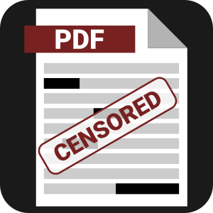
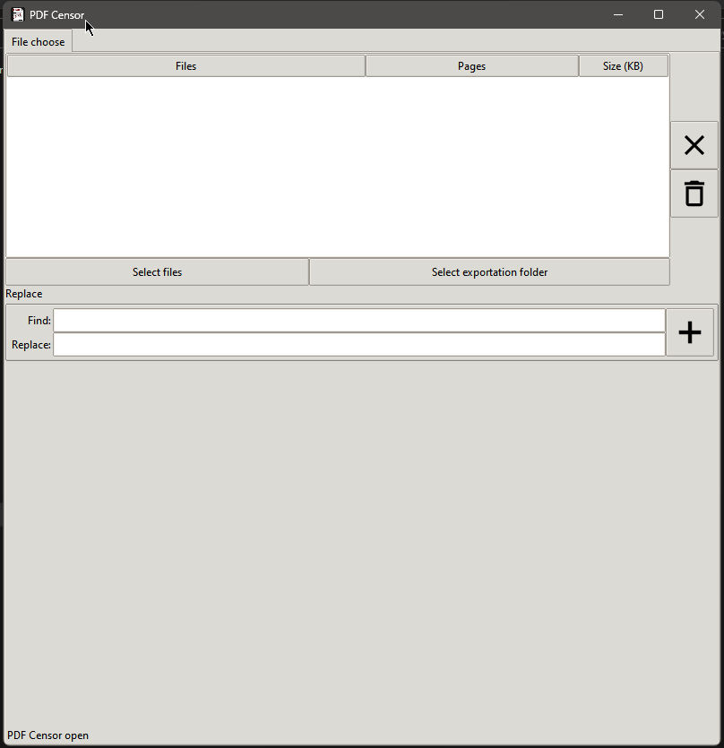
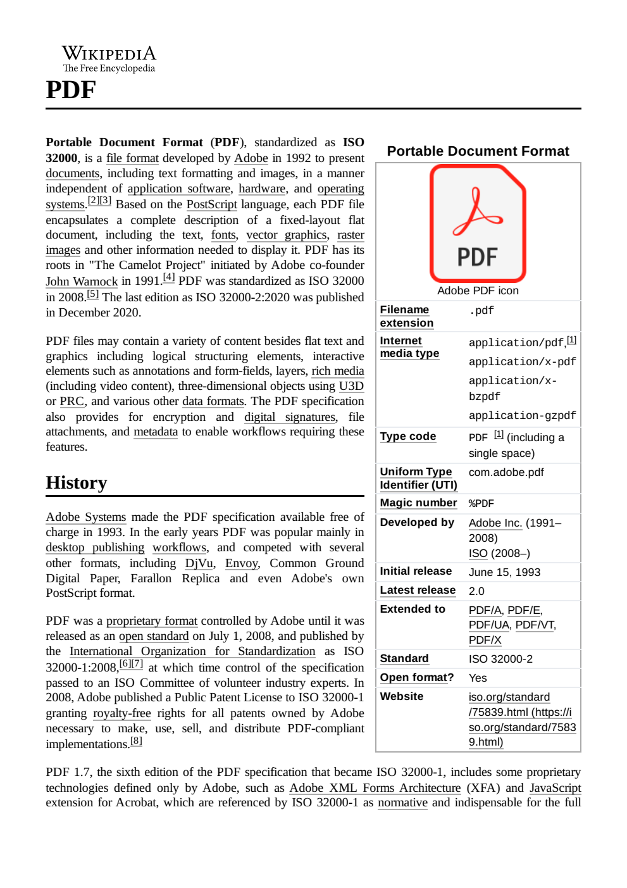
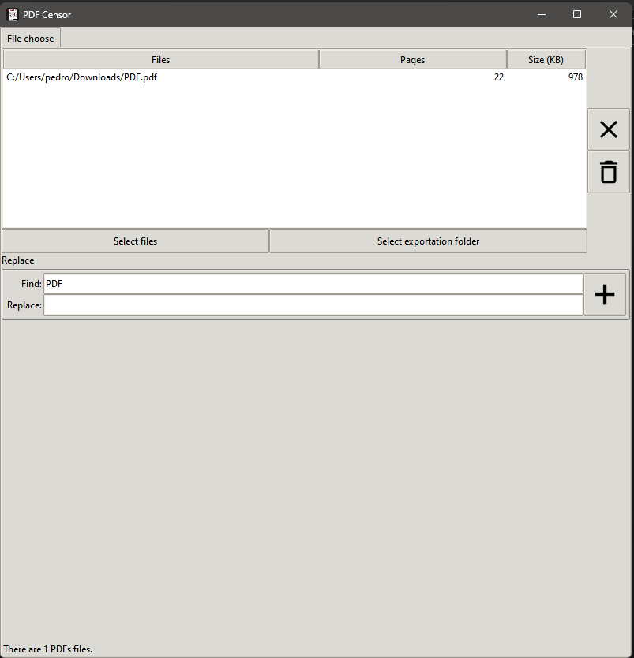
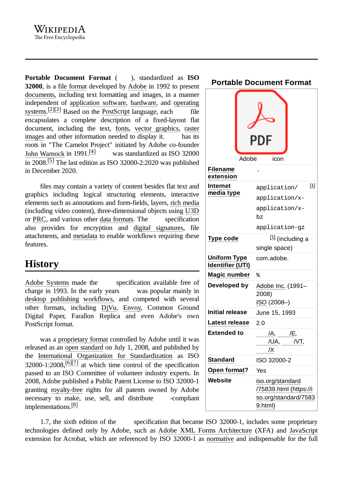

#  PDF Censor

O  **PDF Censor** é um aplicativo de código aberto que permite substituir ou verdadeiramente retirar textos de arquivos PDF. Ele é escrito em Python e utiliza a biblioteca PyMuPDF.

# Instalação

Para instalar o PDF Censor, siga estas etapas:

Clone o repositório do GitHub:

> git clone https://github.com/pho-souza/pdf-censor.git

Entre no diretório do projeto:

> cd pdf-censor

Instale as dependências:

> pip install -r requirements.txt

# Uso

Para usar o PDF Censor, siga estas etapas:

Inicie o aplicativo:

> python pdf_censor.py

Selecione os arquivos PDF que deseja editar:
Clique no botão **"Select Files"** e selecione os arquivos ou arreste-os para a área em branco na tela.

No campo **Replace**, insira o texto que deseja substituir ou remover em **Find** e o que deseja substituir em **Replace**, ou deixe em branco se não precisar substituir.

Após os ajustes, clique em **Select exportation folder** e salve na pasta desejada. O arquivo será salvo com o sufixo **_censored.pdf**

# Exemplo

Considerando a página abaixo:

Para substituir o texto **"PDF"**, siga estas etapas:

    Inicie o aplicativo.
    Selecione o arquivo PDF que deseja editar.
    No campo "Find", insira "PDF".
    No campo "Ação", selecione "Substituir".
    Selecione a pasta de exportação em *Select exportation folder*

Após o arquivo ser exportado, ele ficará com a seguinte configuração:

# Próximos passos

    Melhorar o suporte à substituição para permitir substituições mais complexas.
